# Pokémon Emerald - Mystery Event Online Trading

⚠️ This project has mostly been tested on dolphin, use on real hardware at your own risk. ⚠️

> This project is in development. While it should be functional this version is only intended for use by developers. Feel free to contribute. Trades may freeze the game or fail, requiring restart. 

This project is for allowing in game, online trading on an original version of the game with only original hardware. It puts the trade functionality of https://github.com/KittyPBoxx/pokeemerald-net-demo into a mystery event so that it can be run on an original cartrige. 

 

## Requirements

There are two ways to get this project running:

- Dolphin (For PC) *(Version 5 or higher is recommended as this has the built in GBA link support)*  
- A PC/Server that can run nodejs (or use the test server 130.162.161.228:9000)

### - OR -

- GBA or GBA SP (https://en.wikipedia.org/wiki/Game_Boy_Advance)
- Emerald US Cart (can be real or repro, but CANNOT be a flash cart that has a screen/menu between the bios and copywrite screen)
- DOL-011 cable (https://en.wikipedia.org/wiki/GameCube_%E2%80%93_Game_Boy_Advance_link_cable)
- WII *(Not mini / family edition)* (https://en.wikipedia.org/wiki/Wii) (or Gamecube with Network Adapter/GCNET)
- WIFI Router or Wii ethernet adapter
- A PC/Server that can run nodejs (or use the test server 130.162.161.228:9000)

## Quick Start

### 1 - Load the channel 

    Load the DOL either using the Homebrew Channel (wii) or Swiss (Gamecube)

### 2 - Configure the network

    Go to the netowrk config page in the channel and connect a server. Either
    
    - The dev test server (130.162.161.228:9000)
    - Or run Celios server (for windows/mac/linux)  on your own PC and connect to the IP it says.

### 3 - Start the game

    Plug the game into the console, and turn it on. When it turns on you should see the copywrite screen, then it will flash and you should see the network connection screen. This screen will load for a few seconds then you will hear the 'SUCCESS SFX' if the connection worked correctly. It will then boot directly into the overworld.

    Once in the overworld you can talk to the lab assistant in Birches lab in order to start an online trade. 

    If the game does not go to the network screen or you hear the 'ERROR SFX' in the network screen then the connection was not successful. Check the cables and reset the connection (by pressing START on the GC controller and restarting the GBA). 

## Restricting Trade Partners

Normally trades are done at random with anyone else trading on the server. However, if you wish to trade with a specific person, you can do so by setting the first two word of in your trainer profile for 'FRIEND LINK'. To do this visit the Mystery Gift man in Petalburg Pokecenter (the man next to the PC). Set the first two words of your trainer profile to 'FRIEND' and 'LINK'. Then the second two words to a code you've agreed with the person you wish to trade with. 

For example if you sent your profile to 'FRIEND LINK EVOLVE EGG'. The you will only trade with people who have the profile 'FRIEND LINK EVOLVE EGG'

## Network Diagram

```mermaid
sequenceDiagram
    participant 🎮 GBA
    participant 📺 WII
    participant 🌐 TCP SERVER
    🎮 GBA->>📺 WII: DOL-011 Cable
    Note over 🎮 GBA,📺 WII: (JOYBUS)
    📺 WII->>🌐 TCP SERVER: WIFI
    Note over 📺 WII,🌐 TCP SERVER: (TCP)
    🌐 TCP SERVER->>📺 WII: WIFI
    Note over 🌐 TCP SERVER,📺 WII: (TCP)
    📺 WII->>🎮 GBA: DOL-011 Cable
    Note over 📺 WII,🎮 GBA: (JOYBUS)
```

## How does it work

- When the game boots it checks to see if a GC/Wii is connected.
- If they are, it checks to see if Colosseum is connected (our program reports that it is)
- If Colosseum is connected the GBA game tries to load Colosseum's multiboot image (for battling using your GBA)
- Instead of Colosseum's multiboot we send over a custom compressed one to the GBA's RAM
- That compressed multiboot image, decompresses itself to a later point in RAM and clearing the start of the RAM to make room for games save data.
- And additional payload of code is then copied to the end of the GBA's RAM to a location that the game normally would never access
- After this the cartridge's 'load save' function is called loading the games save data into the, now empty, start of RAM.
- The players data is then sent to the GC/Wii and a request is made to connect to the server. (this could be done in game, but there is limited space for custom code in RAM)
- A custom RAM SCRIPT is then loaded into the save data setting up a mystery event, where talking to Birches assistant will jump to the payload at the end of RAM
- The main callback is then set to the overworld loading code (past the main menu), to bypass the save being reloaded from flash and overriding our changes
- And we jump back into the code halfway through the main boot sequence (in order to avoid the RAM being reset to all 0's)
- Talking to the assistant then jumps to the custom payload which creates an in-game task enabling the registers for JOYBUS communication with the GC/Wii
- The GC/Wii then loops reading data from the GBA. Such as the commands to initiate a trade and the data of the pokemon to send. 
- The GC/Wii then sends the data to the TCP server. If two people are trading at the same time, the server sends a response with the other players Pokemon. 
- The GBA then reads the response data, and if that contains a valid Pokemon, it is copied to the first space of the opponents party.
- The code for an ingame trade is then triggered, switching the opponents first party slot with the players chosen slot and showing the animation.  

## Troubleshooting

#### The game just waits after selecting a pokemon

This happens because the game isn't able to send data over the link cable. This could be an issue with the link cable, however sometime entering and exiting a pokecenter can reset the connection and fix it.

#### The game freezes or stutters after a trade

This happens when the GBA ended the connection but the Wii/GC still thinks theres data left to send. Unplugging the GBA should let the game run normally. The connection on the Wii/GC will need to be reset before another trade can be done.

#### The pokemon I traded to NET DEMO and the pokemon has no HP/LEVEL

NET demo 1.2 and older expect the full pokemon data to be send. However this only sends the minimal amount of data. The pokemons data can be restored by putting it into a box then taking it out.  

## Building from source 

Run the ./build_events script to build everything, the mystery events, the multiboot roms and the GC/Wii channels

## Run

- Make sure CelioServer is running somewhere (either a local computer or the cloud)
- Load either the Gamecube or Wii channel in your chosen device (you should then configure it to connect to the server)
- Connect a GBA to the GC/Wii with a DOL-011 cable, insert an Emerald (USA/EUR) cart with a game started, and boot the device with it plugged in

## References

Multiboot injection
https://github.com/Wack0/gba-gen3multiboot

GC/Wii GUI
https://github.com/dborth/libwiigui

GC/Wii Joybus Data Transfer
https://github.com/afska/gba-link-connection/blob/master/lib/LinkCube.hpp
https://github.com/shonumi/ninja/blob/main/NINJA.c